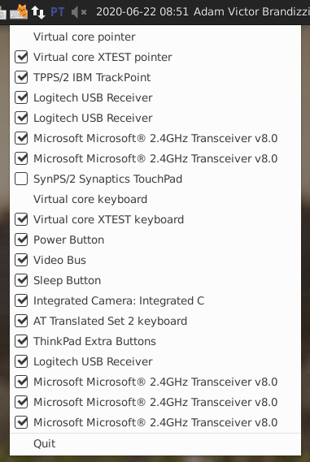
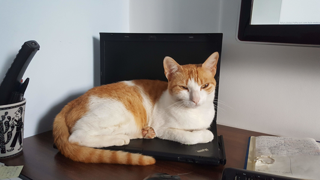

# Input Device Indicator


This app is an indicator to help you disable/enable input devices (such as keyboards, mouses and trackpads).

## How to Use

You just need to invoke `input-device-indicator`. (We do want to be able to 
invoke it from a menu item or a launcher when pressing Super but we did not 
manage to do it so far. Any help is welcome.)

Once activated, there will be an icon (a cat on a keyboard) on your indicators.
Click on it and a list of devices will appear. Just click on the one you want
to disable or enable:



For those more used to technicalities, it can be useful to know this indicator
is basically a wrapper around
[`xinput`](https://www.x.org/archive/current/doc/man/man1/xinput.1.xhtml): the
devices come from the output of `xinput list --long`, and we disable/enable
them with `xinput disable`/`xinput enable`.

## Why?

Because of this:



## Licensing

### Input Device Indicator

```
Input Device Indicator is free software: you can redistribute it and/or modify
it under the terms of the GNU General Public License as published by the Free
Software Foundation, either version 3 of the License, or (at your option) any
later version.

Foobar is distributed in the hope that it will be useful,
but WITHOUT ANY WARRANTY; without even the implied warranty of
MERCHANTABILITY or FITNESS FOR A PARTICULAR PURPOSE.  See the
GNU General Public License for more details.

You should have received a copy of the GNU General Public License
along with Foobar.  If not, see <https://www.gnu.org/licenses/>.
```

### Icons

(The icon is a mashup of [this
icon](https://commons.wikimedia.org/wiki/File:Noto_Emoji_Oreo_2328.svg) and
[this
icon](https://commons.wikimedia.org/wiki/File:Noto_Emoji_KitKat_1f408.svg)
found on Wikimedia Commons, licensed under Apache License 2.0.)

```
Copyright 2020 Adam Victor Brandizzi

Licensed under the Apache License, Version 2.0 (the "License"); you may not use
this file except in compliance with the License. You may obtain a copy of the
License at

    http://www.apache.org/licenses/LICENSE-2.0

Unless required by applicable law or agreed to in writing, software distributed
under the License is distributed on an "AS IS" BASIS, WITHOUT WARRANTIES OR
CONDITIONS OF ANY KIND, either express or implied. See the License for the
specific language governing permissions and limitations under the License.
```
